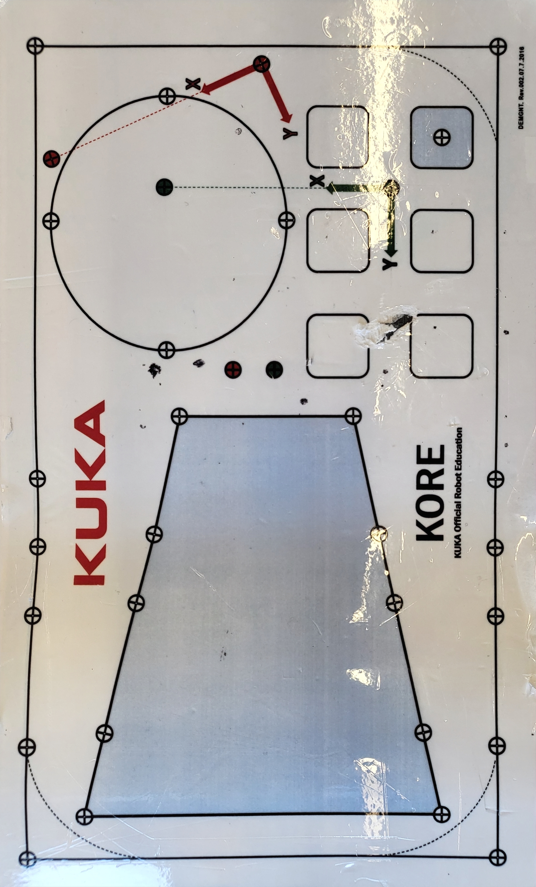

# KUKA Industrial Robotics

> Two semesters of KUKA work — KRL programming on the pendant, WorkVisual on the laptop, integrated with PLCs, validated against NX MCD digital twins.


This repo collects work from **ROB555 — Robotics Basics** and **ROB655 — Robotic Applications** at Seneca Polytechnic, plus the simulation-driven extensions from SIM655. It covers KRL programming on the teach pendant, deeper development in WorkVisual, PLC handshakes for cell integration, and motion validated against an NX MCD digital twin before commissioning on the real robot.

---

## What's in here

### 1. ROB555 — KRL fundamentals on the pendant

Wrote KRL programs directly on the teach pendant — point-to-point, linear, and circular motion (`PTP`, `LIN`, `CIRC`), motion blending, tool/base data, and structured programs with FOR loops and conditionals. The KORE Education plate (KUKA's official training fixture) was used for path-following exercises.

**Representative program — glue-application lab:**

```krl
DEF lab10_zh()
  INI
  GLue_available = $IN[1]
  PTP HOME Vel= 100 % DEFAULT
  for Glue_applications = 1 TO 3 STEP 1
    GLue_available = $IN[1]
    if GLue_available == True then
      contour()
      lenght = lenght + one
    ENDIF
  ENDFOR
  PTP HOME Vel= 100 % DEFAULT
END
```

A simple pattern, but the discipline carries over: input-gated operations, structured iteration, and a clean home position before and after.

### 2. ROB655 — WorkVisual + laptop development

Stepped up from pendant-only programming to **WorkVisual** on a laptop: I/O configuration, safety configuration, tool/base management, and version-control-friendly source files. PLC handshakes formalized into a clean four-bit protocol (`part_ready`, `picked`, `place_ok`, `home`) so neither side assumes timing.

**Lab Test 1 — keg-filling application:**
The instructor's lab test was a worked example I'm proud of: a structure variable holding `Product`, `Bottles`, `Weight (g)`; the program watches an input, fills 5 bottles (each 18.5 g) with 2-second placing delays, then notifies completion. Hits inputs, structures, conditionals, timing, and a notification flow — all the building blocks for real production code, on a tight time limit.

### 3. NX-driven motion (SIM655 extension)

For the engrave / scan exercises in SIM655, KUKA motion paths were generated from NX MCD models and verified in simulation before running on the physical robot. The Romer Absolute Arm was used to scan a target plate (the KORE plate or a custom workpiece) so the robot's tool transform could be calibrated to sub-millimeter accuracy.


*KUKA arm with custom stylus tooling, approaching the KORE Education plate for path-following*


*KUKA KORE Education plate — official training fixture with calibration features and reference geometry*

---

## Tech Stack

| Layer | Technology |
| --- | --- |
| **Robot** | KUKA — KRL on the teach pendant + WorkVisual on the laptop |
| **Toolchain** | WorkVisual V6 — I/O config, safety config, tools/bases, source control |
| **Integration** | Discrete digital I/O handshake with PLC; safety chain wired into both controllers |
| **Validation** | NX MCD digital twin — kinematics import + cycle simulation before commissioning |
| **Calibration** | Romer Absolute Arm for tool/base measurement to sub-mm accuracy |

---

## Highlights

- **Pendant-fluent KRL.** PTP / LIN / CIRC, motion blending, tool & base frames, structured programs — written directly on the pendant under time pressure
- **WorkVisual project layout.** Source files, I/O configuration, safety configuration, tool/base management — the parts of robotics work that don't fit on the pendant
- **PLC handshake protocol.** Four-bit protocol (`part_ready`, `picked`, `place_ok`, `home`) — neither side assumes timing; either side can pause without breaking the cell
- **Digital-twin validation.** Catching reach problems, singularities, and collisions in NX MCD before touching the real robot
- **Sub-mm calibration.** Romer Absolute Arm scans against the KORE plate / custom fixture, then tool transform corrected in WorkVisual

---

## What I learned

- **Hand-shake protocols beat synchronized timing.** Every time I tried to coordinate two controllers with shared timers, it fell apart on the first pause. Explicit "I'm done" / "go ahead" bits made the cell easy to debug and easy to pause.
- **Digital twins pay back time.** A single reach problem caught in MCD saved hours of jogging the real robot. The twin doesn't need to be perfect — close enough to flag the obvious issues is plenty.
- **KRL is more readable than I expected.** Once you separate motion data from sequence logic and name targets after function (`P_pick_home`, `P_place_drop`), KRL programs read like a recipe.
- **Safety configuration is a deliverable.** Not a checkbox at the end. Getting the safety category, gate logic, and E-stop chain right is its own design exercise — and getting it wrong is what hurts people.
- **Calibration is not optional.** The robot's accuracy is meaningless if the tool transform is off. Scanning the workpiece with the Romer arm and measuring the tool against the KORE plate is the routine that turns "demo" into "repeatable."

---

## Repo contents

```
.
├── README.md
├── krl-programs/         # KRL source files (.src / .dat) from ROB555 + ROB655
├── workvisual/           # WorkVisual project — I/O, safety config, tools/bases
├── plc-handshake/        # PLC side of the four-bit handshake
├── nx-mcd/               # Twin models referenced from SIM655
├── lab-docs/             # ROB655 lab test instructions, motion notes
└── assets/
```

---

📫 **Harpreet Singh** — [harpreetsingh.cloud](https://harpreetsingh.cloud) · [GitHub](https://github.com/harpreetsingh52004)
